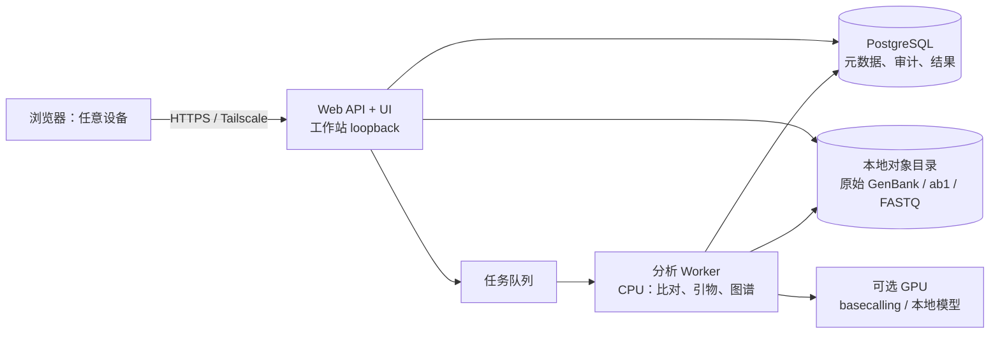

# 本地分子生物学工作台：架构与路线

## 产品定位

这是一个开源、local-first 的分子生物学工作台。它的第一目标不是复制 Benchling 的全部 ELN、注册表和协作能力，而是把一个常见且可验证的闭环做得可靠：

`质粒/模板 → 设计引物 → 送样与回收数据 → Sanger 或全质粒测序比对 → 结论、覆盖缺口和下一步引物`

第一版服务个人研究者；同一套数据模型和 API 必须能迁移到实验室部署。序列和测序文件默认只保存在用户工作站，不能把“使用 AI”变成上传 DNA、样品名称或实验记录的前提。

## 核心原则

1. **证据优先。** “构建正确”必须能追溯到参考序列、读段、比对参数、软件版本和判定规则，不能只有一个绿色图标。
2. **原始文件不可变。** 导入的 GenBank、ab1、FASTQ 和结果文件保存原始哈希；所有解析、编辑和派生结果带版本和父对象。
3. **警告可见。** 解析器修复环状质粒跨原点坐标时，可能改变 feature 的意义。系统要保存原始文件、解析器警告和“需要审阅”的状态，不能静默接受。
4. **本地服务最小暴露。** Web 服务只监听工作站 `127.0.0.1`；浏览器设备通过 Tailscale Serve 访问。数据库、任务队列和对象存储不暴露到局域网或公网。
5. **小而完整。** 每个阶段必须形成端到端的可用闭环，再进入下一个阶段；不先做泛化 ELN、库存或复杂权限系统。

## 目标架构

个人版可先用 SQLite 和单进程后台任务，保持安装简单；实验室版切换 PostgreSQL、对象存储目录和独立 worker。领域对象、对象 ID、审计记录和 API 保持兼容，迁移时不重写业务逻辑。

### 服务划分

| 模块 | 职责 | 个人版 | 实验室版 |
|---|---|---|---|
| Web/API | UI、权限入口、任务提交、结果呈现 | FastAPI 单容器 | 同一镜像，多副本可选 |
| 元数据存储 | 项目、序列、引物、样品、任务、审计 | SQLite | PostgreSQL |
| 文件库 | 原始与派生文件、哈希和保留策略 | 工作站受控目录 | NAS 或 S3 兼容私有对象存储 |
| Worker | CPU 密集的设计、比对、报告 | 同机进程 | 独立容器/节点 |
| GPU Worker | Dorado、模型推理、训练 | 可选 5090 | 可横向扩展 |
| 远程访问 | 仅将 Web 服务交给浏览器 | Tailscale Serve | Tailscale/反向代理 + SSO |

## 数据模型

所有对象使用 UUID，展示名称不是主键。文件名也不是身份，因为 Benchling 导出可以有重名成员。

| 对象 | 关键字段 | 不可变证据 |
|---|---|---|
| Sequence | 序列、拓扑、feature、来源 | 原始 GenBank、序列 SHA-256、解析警告 |
| Sequence revision | 父序列、编辑操作、版本 | 操作人、时间、输入输出哈希 |
| Primer | 序列、方向、Tm、GC、目标区间、设计参数 | 模板 revision、算法/版本、候选集 |
| Sample | 样品名、关联构建、送样信息 | 关联 sequence revision、条码/文件哈希 |
| Read | ab1/FASTQ、方向、质量统计 | 原始文件、哈希、basecaller/解析版本 |
| Alignment | reference、query、算法、参数、坐标 | 输入哈希、CIGAR/变异、软件版本 |
| Verification run | 判定、覆盖、变异、例外 | 使用的 reads、规则版本、完整报告 |

`Sequence` 与 `Sequence revision` 分开：前者可代表导入对象，后者代表用户实际用于设计和验证的版本。这样可以在不毁掉历史结果的情况下修复 feature 或编辑碱基。

## 第一版技术选择

当前原型使用 Python、FastAPI、Biopython 与 SQLite，已实现 Benchling GenBank ZIP 导入、archive/member/sequence 的 SHA-256 溯源、重复 ZIP 成员保留、解析警告保留、本地检索和圆形质粒 feature 图预览。

后续按以下边界实现：

- **质粒图：** 前端 SVG/Canvas 渲染，不把布局做进数据库。圆形序列从 feature 坐标生成扇区；跨原点、未知坐标、或带解析警告的 feature 明确标记，用户可展开查看原始位置。
- **引物设计：** `primer3-py` 负责候选生成；本地比对工具做全模板脱靶筛查。保存全部设计参数和被淘汰原因，保证可复现。
- **Sanger：** ab1 解析、正反向 reads 质控、局部/全局比对、峰图检查入口、低质量碱基与混峰标记。自动判定只能作为建议。
- **全质粒测序：** 定义输入适配器，而不是绑定单个测序供应商。短读长与长读长各有 pipeline；输出统一为覆盖、变异、结构事件、未解析区间和证据链接。
- **NGS：** 第三阶段再加入。把 FASTQ/样品表/参考序列的导入与任务编排做好，避免在个人版中复制完整通用 NGS 平台。
- **AI：** 仅做可选助手，例如自然语言解释报告、从实验记录生成引物候选说明、或本地模型辅助排查。任何结论回链到确定性算法和原始证据；默认不把研究数据发往外部模型。

## 工作站与远程交互

14700K、96 GB 内存和 4 TB SSD 已足够作为第一台工作站。5090 对本地大模型、小规模训练和 GPU basecalling 有价值，但 Sanger、引物设计和多数质粒比对主要受 CPU、内存与 SSD 影响。优先保证备份和磁盘余量；96 GB 正常可用，后续批量长读/组装多时再考虑 128 GB。

建议在工作站使用 Ubuntu LTS、Docker Compose 和 Tailscale：

1. 服务以 Docker Compose 运行，宿主端口固定为 `127.0.0.1:8000`。
2. Web 设备加入同一 tailnet，通过 `tailscale serve 8000` 访问；不启用 Funnel，不开放路由器端口。
3. SSH 仅用于维护，采用 SSH key、禁用密码登录；优先 Tailscale SSH。应用文件目录独立于容器，可备份且权限最小化。
4. 每日备份数据库和对象目录，至少保留一个脱机或异地副本；定期用恢复演练验证备份。
5. 多人版增加 OIDC、项目级角色、审计日志和加密备份；数据隔离与权限在进入多人版前完成，而不是事后补救。

## 交付路线与验收条件

### 阶段 0：数据接入基础（当前）

- Benchling GenBank ZIP 安全导入；重复文件名不丢失。
- 保存原文件、成员文件、规范化序列的 SHA-256。
- 解析失败、跳过项和 parser warning 可见、可查询。
- 用私有真实导出验证，用合成数据测试；真实研究数据绝不进入公开仓库。

**验收：** 可从浏览器导入、检索并追溯每个序列的来源；重新上传同一压缩包被明确拒绝，不产生重复数据。

### 阶段 1：质粒与引物闭环

- 环状/线性质粒图、feature 编辑和版本化。
- Primer3 候选、PCR/测序模式、局部和全质粒脱靶筛查。
- 引物表导出、关联构建和命名策略。

**验收：** 用户可从一个具体的质粒 revision 生成候选、解释淘汰原因、选择引物，并在图上看到绑定位置。

### 阶段 2：Sanger 验证闭环

- 上传 ab1、质量统计、读向识别和参考比对。
- 位点级变异、覆盖与低置信区域；提供峰图复核入口。
- 可导出验证报告，清楚区分“已验证”“不确定”“失败”。

**验收：** 用户可用一组正反向 Sanger reads 验证一个构建，报告展示证据、覆盖缺口和推荐的补测序引物。

### 阶段 3：全质粒与批量分析

- 长读/短读适配器、任务队列、可恢复任务和资源限制。
- 共识序列、SNV/indel/结构事件、覆盖环图与批量报告。
- 基准数据集和可复现 benchmark 命令。

**验收：** 一批样品可以排队计算，页面可追踪任务、失败原因和完整输入输出版本。

### 阶段 4：实验室多人版与开放生态

- PostgreSQL 迁移工具、用户/角色/项目、审计和备份恢复文档。
- CLI、稳定 API、插件式分析器、示例数据和贡献指南。
- 不同平台的可重复安装包与安全更新策略。

**验收：** 新实验室可在自己的服务器部署、导入示例数据、跑通验证流程，并在不改核心代码的情况下接入新的测序分析器。

## 不做的事情

在前四个阶段，不把通用笔记本、采购、库存、动物房管理或所有组学工作流塞进核心。它们可以通过 API 或插件接入；核心团队应把精力留给质粒、引物和验证证据链。
