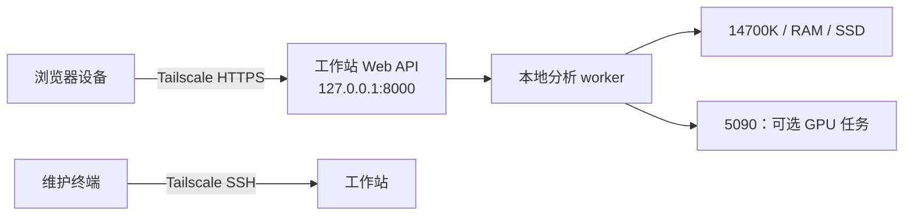

# 工作站、Tailscale 与 SSH

## 运行边界

工作站是唯一的数据与计算节点：运行容器、数据库、原始文件库、Primer3、Sanger/全质粒分析 worker，以及可选 GPU 任务。笔记本、平板或当前设备只打开浏览器。

因此正常使用不需要“把任务 SSH 过去”：浏览器通过 Tailscale Serve 访问工作站上的 Web API，任务由工作站本地队列执行。SSH 用于首次部署、升级、查看日志和维护，避免把任意 shell 命令暴露给产品 UI。



## 一次性部署步骤

以下在 Ubuntu 工作站执行；将 `molbio-workstation` 换成你希望看到的 MagicDNS 机器名。

1. 安装 Docker Compose 和 Tailscale，登录到与你的浏览器设备相同的 tailnet。
2. 在工作站开启 Tailscale SSH：

   ```bash
   sudo tailscale set --ssh
   ```

3. 将此仓库 clone 到工作站的受控磁盘目录，启动服务：

   ```bash
   docker compose up --build -d
   ```

4. 容器只将服务绑定到工作站 loopback。将它私密发布给 tailnet：

   ```bash
   tailscale serve --bg localhost:8000
   tailscale serve status
   ```

5. 从浏览器设备访问 `https://molbio-workstation.<你的-tailnet>.ts.net`。Tailscale 会显示实际 URL；不需要路由器端口转发，也不使用 Funnel。

## 维护连接

优先使用 Tailscale 自己的 SSH 客户端，它会校验工作站发布的主机密钥：

```bash
tailscale ssh <工作站-本地用户名>@molbio-workstation
```

连上后，常用维护命令是：

```bash
cd <仓库目录>
docker compose ps
docker compose logs -f app
docker compose pull
docker compose up -d
```

不要把 Docker daemon、SQLite/PostgreSQL、对象文件库、worker 队列或 8000 端口直接发布到局域网和公网。

## Tailnet 访问策略

在 Tailscale Admin Console 的 Access controls 中，为工作站加一个专用 tag，并将 SSH 收紧到你的账户与该工作站。策略结构如下；实际的 tailnet 用户名和 tag 需要替换后保存：

```jsonc
{
  "tagOwners": {
    "tag:molbio-workstation": ["autogroup:admin"]
  },
  "ssh": [
    {
      "action": "check",
      "src": ["<你的-Tailscale-身份>"],
      "dst": ["tag:molbio-workstation"],
      "users": ["<工作站-Linux-用户名>"]
    }
  ]
}
```

`check` 会在连接时要求重新确认身份，适合管理员 SSH。浏览器访问继续由 tailnet ACL 控制。保留工作站的本地控制台作为故障恢复路径；启用 Tailscale SSH 会接管该节点 Tailscale IP 上的 22 端口。

## 后续扩展到独立计算节点

当单台工作站不够时，Web/API 仍在主工作站。队列将一个带输入哈希、容器镜像版本和资源要求的 job manifest 交给命名的 worker。worker 只接受这些类型化任务，例如 `sanger-verification` 与 `plasmid-verification`；它不执行来自 UI 的任意 shell 文本。

第二台计算机同样进入 tailnet，并以 Tailscale SSH 或一个私有 worker API 接收 manifest。结果和日志回传到主工作站的对象目录，再由 Web/API 呈现。这样增加 GPU/CPU 节点不会改变数据证据链或浏览器访问方式。
